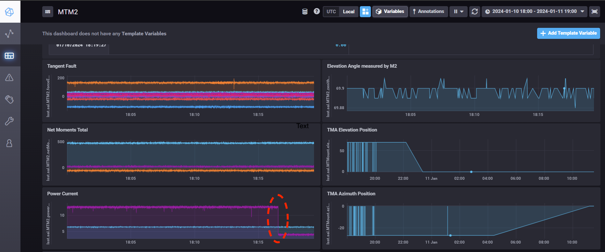

.. _Recover_System_Night:

###########################
Recover the System at Night
###########################

This document gives the step-by-step procedures for people to recover the system at night while most of engineers are unavilable at that time period.
This document only focuses on the normal errors happened at night such as the interlock, power-cut, etc. and might not fit the special actions such as the rigid body movement and others, which would need to follow :ref:`Error_Handling` to recover the system.

The M2 should be under the closed-loop control all the time at the normal night survey.
Once the errors happened, the M2 commandable SAL component (CSC) will transition to the **Fault** state, which can be checked from `LOVE <http://love01.cp.lsst.org>`_ or `Chronograf <https://summit-lsp.lsst.codes/chronograf>`_ (you need to be in LSST control network to see the pages).
The events of log and error code provide the hint of failure.

To recover the sytem, do the followings:

1. Check the last measured elevation angle that the M2 was in the closed-loop control (see the figure below as an example). If that angle differs the current elevation angle of telescope mount assembly (TMA) by more than 2 degree, you need to move the TMA to the last angle of M2 first.

  The motor current dropped from 12.5 A to be 4.2A around 18:16 (see the red dash circle). This means the system left the closed-loop control at that moment. The elevation angle measured by M2 is around 69.9 degree at that time.

2. Follow the :ref:`lsst.ts.m2gui-error_restart_control_system`.

3. Follow the :ref:`lsst.ts.m2gui-error_reset_m2_interlock_signal`.

4. Use the M2 Python graphical user interface (GUI) to put the system into the closed-loop control. See :ref:`lsst.ts.m2gui-user_local_mode` for the details. You might need to click the button of **Reset All Items** multiple times if there is the error in this process (see :ref:`lsst.ts.m2gui-user_alarm_warn`). If the system can not transition to the closed-loop control after some trying, you will need the help from maintainers.

5. Transition the system back to the open-loop control, **Diagnostic** state, and the **Standby** state in the final. Disconnect from the cell controller and exit the GUI.

6. Use the M2 CSC to transition the system to the **Enabled** state. If you use the **LOVE**, you may need to wait a little bit when transitioning the **Disabled** state to the **Enabled** state. See the related log message if needed. Sometimes, you may need to set the logging level to be **DEBUG** in this process (see the `logging levels <https://docs.python.org/3/library/logging.html#logging-levels>`_).
