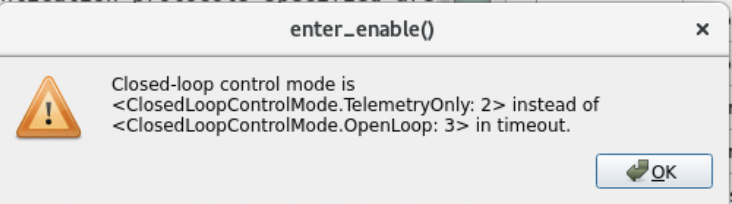
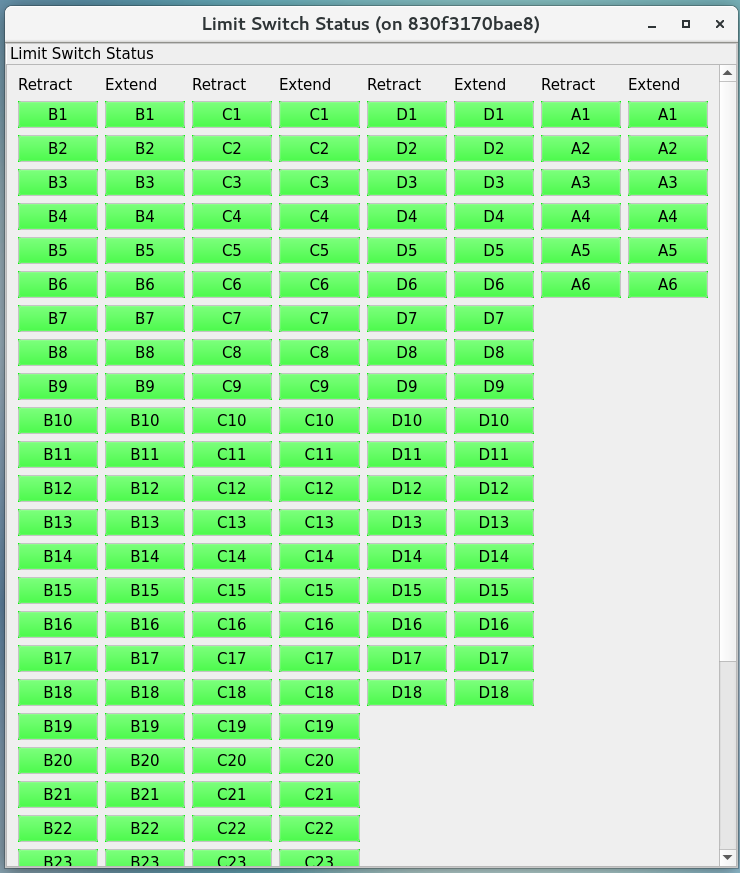
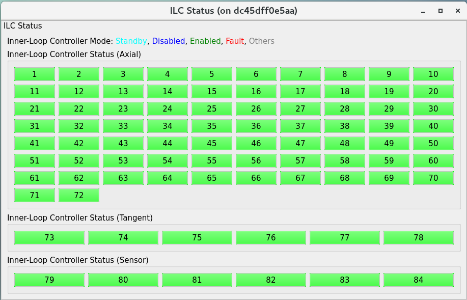
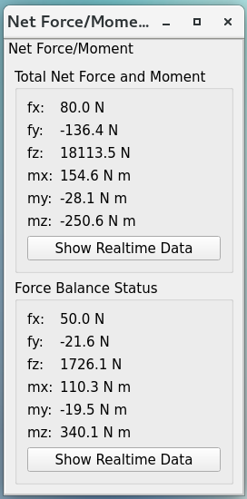
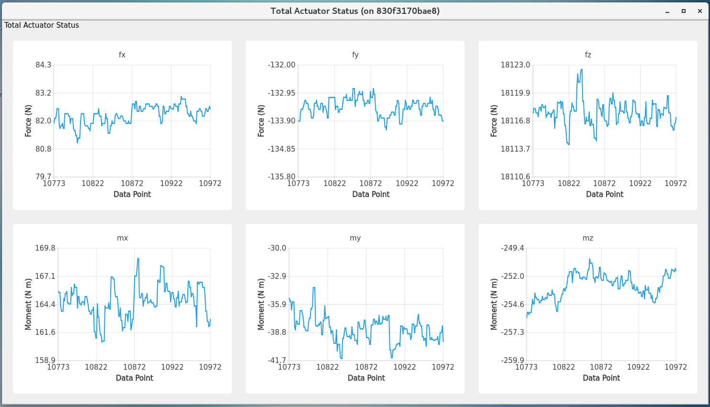
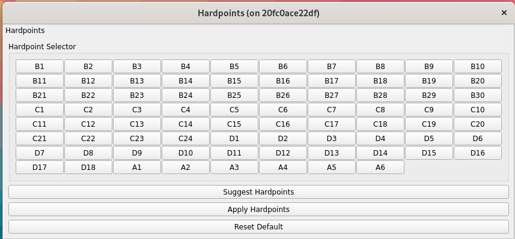

.. _User_Guide:

################
User Guide
################

This graphical user interface (GUI) is a Qt-based application to control the actuators, observe sensor telemetry, show the configurable parameter settings of the M2 cell control system, reset faults, and diagnose issues observed during the operation.
This GUI is supposed to be used by the hardware engineers or operators to have a more detailed control of hardware compared with the automatic or remote mode (a.k.a. commandable SAL component, CSC): `ts_m2 <https://ts-m2.lsst.io/>`_.
If the GUI can not put the system into the closed-loop control, the M2 CSC will not be able to as well because they are using the same interface to the control system.
Functionality of the GUI will be discussed in detail to provide the reader a comprehensive source for understanding the operation of GUI.

It is noted that there might be the inconsistency of internal data if you had used the deprecated M2 LabVIEW GUI to control the M2 already.
To fix the issue of internal error, the easierst way is to restart the cell control system (see :ref:`lsst.ts.m2gui-error_restart_control_system`).

.. note::
  This GUI is to replace the original LabVIEW GUI: `ts_mtm2 <https://github.com/lsst-ts/ts_mtm2>`_, and the related executable is ``runM2Cntlr``.
  If the LabVIEW GUI was used to run the system with the opened- or closed-loop control, you may need to restart the control system (see the :ref:`lsst.ts.m2gui-error_restart_control_system`) before using the Python GUI or CSC to control the system.
  This GUI will end the support soon (see `DM_43478 <https://rubinobs.atlassian.net/browse/DM-43478>`_).
  At this moment, it only plays the role to show the system status when the CSC is controlling the system when needed as the debug purpose.

.. _Operation:

Operation
============

Use the command line in terminal to run the GUI by ``run_m2gui``.
The simulation mode is provided to let you to be familiar with the application.
You can do the following to get more information of GUI.

.. code:: bash

    run_m2gui -h

By default, there will be a log file created under the ``/rubin/mtm2/log`` or ``$HOME`` directory to support the debug.
You can assign the `logging level <https://docs.python.org/3/library/logging.html#logging-levels>`_ from the command line or use the GUI (see :ref:`lsst.ts.m2gui-user_settings`).

The operation of GUI is explained below.
For each action (or click the button), you need to wait for some time to let the GUI finish the related command with the control system in the timeout period.

.. _lsst.ts.m2gui-user_main_panel:

Main Panel
----------

.. figure:: ../screenshot/main_panel.png
  :width: 250

  Main panel of application

After the execution of GUI, you will see the above main panel.
You can use the top toolbar to change the **Settings** of GUI, **Connect**/**Disconnect** the M2 cell controller, and **Exit** the application.
The central region of panel is to change the command source between the remote (or automatic, see `ts_m2 <https://ts-m2.lsst.io/>`_) and local controls, and transition the system into different state or control mode (closed-loop or open-loop control).

When the M2 system is operating in remote mode, all the commanding features of the GUI are disabled and the GUI is set to a Read-Only mode where the event and telemetry can be viewed, but no changes to the M2 controller can be made.
This is to prevent conflicting commands between the local and remote systems.
When the M2 system is operating in the local mode, commanding from the GUI is activated and you can begin to interface with the M2 controller.

The bottom region of main panel has multiple tables that you can double-click to open to have more detailed system information or finer control of actuators.
If you move the mouse close to the buttons/indicators and texts in panels and tables, you will see the prompted tips to explain the related details.

.. _lsst.ts.m2gui-user_settings:

Settings
--------

.. figure:: ../screenshot/settings.png
  :width: 550

  Settings of application

You can modify the settings in application.
The default values come from the configuration file.
You can do the following things:

#. Update the host name, ports, and connection timeout in TCP/IP connection.

#. Use the internal inclinometer or external one (e.g. telescope mount assembly, TMA) to get the elevation angle used in the look-up table (LUT) correction. If the angle comparison is enabled, the controller will compare the internal and external values, and fault itself if they differ more than the threshold to protect the mirror. If the external elevation angle is used, the angle comparison will be enabled automatically.

#. Parameters in the LUT correction. You can overwrite (or fake) the external elevation angle for the test purpose when the external angle is used. The value of temperature reference will be updated once the connection with cell controller is on, and it receives the related event from the controller.

#. Parameters to set and get the inner-loop controller (ILC) state. Sometimes, you may need to tune these if the internet traffic is jamed.

#. General settings of application. You can use the different `logging level <https://docs.python.org/3/library/logging.html#logging-levels>`_ to support the debugging if needed. The log file will be in the ``/rubin/mtm2/log`` directory. If it does not exist in file system, the log file will be in the ``$HOME`` directory. If the logging level is **DEBUG**, you will see the statistical telemetry rate (should be ~20 messages/sec at **Disabled** state and ~100 messages/sec at **Enabled** state), received event and command acknowledgement/status, ILC data (only meaningful if the ILC is in the Enabled state), and more.

After the modification of settings, you can click the related **Apply** button to use the new values.

.. _lsst.ts.m2gui-user_local_mode:

Local Mode
----------

.. figure:: ../screenshot/local_mode.png
  :width: 250

  Local mode

You can control the M2 directly from the local mode (click the **Local** button after the connection with the controller is on).
If the system is under the remote control originally, this action will take over the control, and the M2 cell controller listens to the command from GUI only.

Before the state transition, you need to connect to the M2 cell first.
If you lost the connection after you connected to the M2 cell, most likely, you lost the internet or someone power-cycled the M2 system but you did not notice that.
To confirm the latter, you can try to log in the M2 cRIO (see :ref:`lsst.ts.m2gui-error_restart_control_system`) and check there is any new log file created or not (see :ref:`lsst.ts.m2gui-error_log_file`).

Then, you should check the **Enabled Faults Mask** value should not be 0.
See the :ref:`lsst.ts.m2gui-user_alarm_warn` for the details.
If it is 0, you will need to restart the application (see :ref:`lsst.ts.m2gui-error_restart_control_system`) to reset the internal data.

You can transition the system into the **Diagonostic** state to check the system status without energizing the actuators.
By default, the **Diagonostic** state does not have the powers of communication and motor.
It would be good that you can check the interlock first before transitioning to the **Enabled** state.

Based on the circuit configuration, the interlock might be released after the motor power is on or the motor power could not be turned on because the interlock signal is still there.
You can use the **Diagnostics** table to toggle the motor/communication power to check the circuit of interlock at that time if you could not enable the system successfully.
See the :ref:`lsst.ts.m2gui-user_diagnostics` for more details.

If everything looks good, you can transition the system into the **Enabled** state to command the M2 hardware with the open-loop or closed-loop control (do not forget to turn off the motor and communication power first if this will be the first time to transition to the **Enabled** state).
If the interlock is on, you would not be able to transition to the **Enabled** state.
Sometimes, you may need the global interlock system (GIS) to reset the interlock signal of M2.
See :ref:`lsst.ts.m2gui-error_reset_m2_interlock_signal`.
If the GIS signal exists, you would not be able to power on the motor and you might have the following prompt window:

.. figure:: ../screenshot/gis_block_motor_power.png
  :width: 350

  GIS blocks the motor power

You can see :ref:`lsst.ts.m2gui-user_diagnostics` to know how to check the interlock signal manually.

If you see a prompt window as the following to say the closed-loop control mode can not be **OpenLoop** in the timeout, there should be something wrong now in the system.
You can see the :ref:`lsst.ts.m2gui-user_overview`, :ref:`lsst.ts.m2gui-user_diagnostics`, :ref:`lsst.ts.m2gui-user_alarm_warn`, and others to see the possible reason to fix the issue.

  Enable failed

It is recommanded to check the ILC status as well while transitioning to the **Enabled** state (see :ref:`lsst.ts.m2gui-user_ilc_status`).
If there are only a few ILCs could not be enabled, you could try to increase the retry times in :ref:`lsst.ts.m2gui-user_settings`.
But if there are many, you may need to restart the application (see :ref:`lsst.ts.m2gui-error_restart_control_system`) or power-cycle the entire system.

If the system is under the closed-loop control, the LUT correction and force balance system are applied to compensate the affection from the temperature fluctuation and gravity.

.. _lsst.ts.m2gui-user_exit:

Exit
----

.. figure:: ../screenshot/exit.png
  :width: 250

  Exit the application

You can click the **Exit** button to leave the application, and a window will prompt out to confirm this action.
Before the exit, you need to disconnect the GUI from the controller first.
If the power is being applied to the M2 cell assembly prior to hitting the **Exit** button, the M2 cell control system will gracefully power down before stopping the process as the safe mode defined in the controller.

.. _lsst.ts.m2gui-user_overview:

Overview
--------

.. figure:: ../screenshot/overview.png
  :width: 200

  System overview

You can check the system high-level status by the overview table.
The logged message will be recorded in the text table and related log file (if you use it) and you can use the button of **Clear Message** to clear it.

If the interlock is engaged, the related indicator will become red to remind the user.
See the :ref:`lsst.ts.m2gui-user_local_mode` and :ref:`lsst.ts.m2gui-user_diagnostics` for more details.

.. _lsst.ts.m2gui-user_actuator_control:

Actuator Control
----------------

.. figure:: ../screenshot/actuator_control.png
  :width: 550

  Actuator control

Under the actuator control table, you can directly command individual or multiple actuators under the open-loop or closed-loop control.
The former is to move the selected actuators with the specified distance or step, and the latter is to apply the force.

The actuator selector group allows you to pick which actuator is to be sent the command.
Buttons within the actuator selector group facilitate the selection of one or multiple actuators.
The actuators are identified by their alphanumeric cell designations as illustrated by the T14900-1000 drawing.
The group select feature allows you to select the entire rings of actuators at a time without having to click each individual cell.

Once the actuator(s) has been set in the actuator selector group, the actuator control group then determines the distance/step/force the actuator is commanded.

The open-loop commanding distance can be specified in millimeters or actuator steps.
If commanding the actuators in steps, the input must be an integer number.
With the actuator selections complete and the distance to move entered, you can select the **Start** button to send the command out to the actuator(s).
During the execution of the open-loop command the **Stop**, **Pause**, and **Resume** commands in the actuator control group can be used to intervene if necessary.

The closed-loop commanding is to **apply** or **clear** the forces on actuators.
You can only have the open-loop or closed-loop commanding at a single time.

To be consistent with other procedures, a *Retract* move requires a negative step or mm command while an *Extend* move requires a positive step or mm command in the actuator control group.
The step speed limit when in closed-loop control is dictated in configuration files and can be changed but is traditionally limited to 75 steps per sample in control loop for both axial and tangent actuators.

You can also use the script to control the actuators continuously (see `ts_mtm2_matlab_tools <https://github.com/lsst-ts/ts_mtm2_matlab_tools>`_ for the details).
This provides you the ability to run pre-processed scripts as open-loop or closed- loop command to the M2 controller.
The intent of script control is to provide the ability to command time-based waveforms of either step/distance commands or force commands.

The script control group will only permit an open-loop script if the system is under the open-loop control, or a closed-loop script if the system is under the closed-loop control.
When a closed-loop script is commanded, it is sent as a delta force command (as applied force) to the current LUT-based force command.
It is analogous to the ``applyForces()`` command in remote operation mode, but the script can send a block of force commands which execute at each time step.
At each time step, the command (whether open-loop or closed-loop) must be determined for all 78 actuators.

The script is executed one sample at a time until the end of the script is reached.
Upon finishing, the system will remain in the same mode under which the script was executed.
To use the script control feature, ensure the system is in the **Enable** state and select the open-loop or closed-loop control based on the script to be run.
Next select the **Load Script** button in the script control group.
This will bring up an explorer window to allow the user to select the desired script to be run.
This file should exist in the cell controller under the ``/u/script`` directory as well.

Once the script has been successfully loaded, the **Run** button may be selected.
The progress bar in the script group will display the percentage of the script that has been executed.
During the script execution, the **Stop**, **Pause**, or **Resume** buttons can be used to intervene in the script operation.

The summary of measured force contains the statistical information about the forces on the axial and tangent actuator sets.

.. _lsst.ts.m2gui-user_configuration_view:

Configuration View
------------------

.. figure:: ../screenshot/configuration_view.png
  :width: 550

  Configuration

You can use the configuration view to observe the current values of the configurable parameters in the M2 cell controller.
For creating and editing configuration files, reference the Configuration File Description Document (T14900-1005), or `ts_mtm2_matlab_tools <https://github.com/lsst-ts/ts_mtm2_matlab_tools>`_.

You can select the available configuration file in controller to apply.
The list of available configuration files comes from the ``/u/config`` directory in controller.
You can add the new file into the above directory in controller or do the pull request to `ts_mtm2_cell <https://github.com/lsst-ts/ts_mtm2_cell>`_ (private repository).
The new setting will be applied when the system transitions to the **Enabled** state.

.. _lsst.ts.m2gui-user_cell_status:

Cell Status
-----------

.. figure:: ../screenshot/cell_status.png
  :width: 550

  Cell status

The cell status view is intended to provide a quick summary of the M2 cell control system at a glance.
It does not contain any state dependent features; therefore it will always be active.
The cell status view contains plots of critical telemetry against the current time to provide the time history of data such as the measured force, force error between the demanded and measured forces, etc.

A force contour plot is also provided in the cell status table.
The force contour plot is updated with the application refresh frequency and is meant to provide the additional visual feedback on the status of the M2 system.
You can show the measured forces of axial acutators, tangent links, or all actuators.
You can also select a single actuator on the force contour plot to know the current force on it in real-time.

.. _lsst.ts.m2gui-user_utility_view:

Utility View
------------

.. figure:: ../screenshot/utility_view.png
  :width: 550

  Utility status

The utility view allows you to observe auxiliary sensor feedback from the cell and interface with some low-level system commands.
It is divided up into the power, elevation angle, breaker, temperature, and displacement sensor groups.

The power groups display the current status of the communication and motor power supplies.
The voltage and current are displayed for both.
The state of power system (see `PowerSystemState <https://github.com/lsst-ts/ts_xml/blob/develop/python/lsst/ts/xml/enums/MTM2.py>`_) in controller is shown as well.

The elevation angle group provides the internal raw elevation angle and the processed (or calibrated) value.
The processed value is used in the LUT correction.
These two angles have the different coordinate systems.
The received external elevation angle is shown here as well, which should have the same coordinate system as the processed inclinomemter angle.
If the processed and received elevation angles differ too much, the system might fault itself to protect the mirror.
You can use the setting table to adjust the related parameters in comparison.

The breaker groups show the current status of the individual breakers on the power supply lines to the cell.
Buttons are available to reset the breakers for the motor or communications power lines independently.

The temperatures group is separated into the cell internal temperatures and the mirror temperatures.
The cell internal temperatures monitor the intake and exhaust of the cooling system in the cell.
The mirror temperatures indicate the temperatures sensed at the discrete locations on the back of the mirror.
Reference the T14901-1000 drawing for mapping the indices to physical locations on the back of the M2 mirror.

The displacement sensors display the current telemetry reported by all 12 displacement sensors.
An orthogonal pair of displacement sensors exist at each tangent pad location.
They are used to calculate the rigid body position at :ref:`lsst.ts.m2gui-user_rigid_body_position`.

.. _lsst.ts.m2gui-user_rigid_body_position:

Rigid Body Position
-------------------

.. figure:: ../screenshot/rigid_body_position.png
  :width: 550

  Rigid body

The rigid body position table provides you the ability to adjust and view the current rigid body position of the M2 mirror.
Following the protocol of the M2 interface communication document (ICD), the rigid body position group will only accept commands when the system is in the **Enabled** state and closed-loop control.
When the system is not in the states as specified, the rigid body position table can still be used to view the current rigid body position of the M2 mirror.
All coordinates reference the optical coordinate system provided in LTS-136.
The positions based on the hardpoints and displacement sensors are provided for the comparison.

The **Move with Offset Relative to Current Position** group sends a relative six degree of freedom command to the mirror to jog it with respect to its current position.
Enter the desired six degree of freedom relative command in the input boxes and select the **Jog** button to send the commands to the controller.
Once complete, the change will be reflected in the **Current Position Relative to Home** group.

The **Move to Position Relative to Home** group allows the user to enter an absolute six degree of freedom position to command to the mirror.
The absolute position is relative to the home position.

The rigid body position table also allows you to use the current position of the mirror to set the home position.
By selecting the **Set Home** button, the current position is written into the M2 cell controller as the new home position and now all absolute positions are relative to this new home position.
A **Home** position must be set prior to using any absolute position moves.
A reasonable (near midstroke of all actuators) **Home** position was set prior to shipment but can be rewritten any time.
Since most of the internal calculation is based on this **Home** position, do not set the new **Home** position unless you know what you are doing.

Selecting the **Go To Home** button will drive the mirror from its current position to the saved **Home** position.
Using the **Move to Position Relative to Home** group and entering all zeros for each degree of freedom is equivalent to selecting the **Go To Home** button.
Current position can be saved by using the **Save Position** button.
You need to modify the configuration file (`home_position <https://github.com/lsst-ts/ts_mtm2_cell/blob/develop/config/home_position.xml>`_) in controller to use the new saved position file as **Home** by default.

.. _lsst.ts.m2gui-user_detailed_force:

Detailed Force
-------------------

.. figure:: ../screenshot/detailed_force.png
  :width: 550

  Detailed force

The detailed force table is a read-only display of the current forces and displacements of each actuator on the M2.
The selected hardpoints are displayed in the **Hard Points** group to the top of the table.
They are 1-based actuators that support the mirror at a fixed position.
For example, index 6 means the B6 actuator.

The upper selector allows the user to quickly jump to individual sets of actuator rings within the cell.
The unit of displayed force is Newton.
The force values displayed in the force table detail the components of the demanded force as well as the raw measured force from the load cell.

For the hardpoints, the hardpoint correction and force error should be 0.
For non-hardpoint actuators, the force errors should be the difference between the demanded and measured forces.

.. _lsst.ts.m2gui-user_diagnostics:

Diagnostics
-----------

.. figure:: ../screenshot/diagnostics.png
  :width: 550

  Diagnostics

The diagnostics table provides further lower level interfaces within the cell.
This table is available for observation any time during the operation of the M2 but the input buttons are only valid when the controller is in the **Diagnostic** state.
When in the **Diagnostic** state, you can command individual binary signals to the cell regarding breaker resets, individual power supply controls, or interlock (see the **Digital Output Controls** group).

The diagnostic table provides telemetry feedback on the individual power supplies in both the calibrated and raw forms.
In addition, the diagnostics view contains the real-time telemetry of the tangent load cell fault monitoring as well as the raw and calibrated power telemetry for the motor and communications power buses.

The groups of tangent weight error, tangent error, and tangent force error are used to judge the glass safety.
When the mouse is closed to the field in groups (for example, **Total Weight Error**), the threshold of each field will be shown.
If any value is equal or higher than the threshold, the system will shutdown the motor power and transition to the **Diagnostic** state to protect the mirror.

It is noted that only when the D2 ("interlock enable" in digital output) and D31 ("interlock power relay on" in digital input) indicators are green when the digital output controls D0 (motor power) and D1 (communication power) are on, the interlock is disengaged.
This implies that you could manually toggle on/off the D0 and D1 to check the interlock signal exists or not.
If you do so, you always need to turn on the communication power first followed by the motor power, and turn off the motor power first followed by the communication power.

The diagnostics table also contains a button to reboot the cell controller.

.. _lsst.ts.m2gui-user_alarm_warn:

Alarms/Warnings
---------------

.. figure:: ../screenshot/alarm_warn.png
  :width: 550

  Alarms and warnings

The alarms/warnings table provides the detailed feedback on the current faults and warnings state of the controller.
This table lists all possible faults and warnings that are evaluated via the M2 cell control software.
Selecting one of the faults allows you to see the additional details and characteristics of the fault or warning condition.

During operation, if a fault is present, the fault row will highlight in red, or yellow for a warning.
The alarms/warnings table contains the user input to manually reset the faults/warnings.

The **Summary Faults Status** and **Enabled Faults Mask** are shown in the table.
The former summarizes the current faults in controller as a 64-bits value, and you can see the details in `error_code <https://github.com/lsst-ts/ts_config_mttcs/blob/develop/MTM2/v2/error_code.tsv>`_.
The latter gives the current faults mask in controller as a 64-bits value, and it should not be zero.
Otherwise, something might be wrong in the controller.
If any error code is bypassed in the control loop, this mask will reflect the change.

You can bypass the error codes or reset the fault mask.
To bypass the error codes, you need to select the error codes to bypass first.
Then, click the **Bypass Selected Errors** button, and the GUI will prompt a small window to let you confirm.
Do not do this unless you know what you are doing.
You can click the **Reset Enabled Faults Mask** button to remove all the bypassed error codes.

The **Reset All Items** button resets all faults and if the fault condition has been removed, the fault will clear and the red highlighted row(s) will be removed.
You can always try to reset all errors to remove the out-of-date signals.

In some cases, you may want to use the button of **Enable Open-Loop Max Limits** to allow an increased force range to move some specific actuators back to safer positions.
This can only be done under the open-loop control, and it will be reset back a smaller force range after the system transitions to the closed-loop control.

You can click the **Show Limit Switch Status** button to check the limit switch status that is explained in the following section: :ref:`lsst.ts.m2gui-user_limit_switch_status`.

.. _lsst.ts.m2gui-user_limit_switch_status:

Limit Switch Status
--------------------

  Limit switch status

The limit switch status are displayed via indicators for each actuator.
The retract and extend limit switches are displayed in individual columns.

The green color means normal.
If the actuator's force is close or over the software limit, the indicator will be yellow as a warning.
When the hardware limit switch is triggered, the color will become red.
Any triggering of limit switch status will block the system to transition into the **Enabled** state.

.. _lsst.ts.m2gui-user_ilc_status:

Inner-Loop Controller (ILC) Status
----------------------------------

  ILC status

The ILC status table provides the detailed mode of each ILC with the ModBUS ID.
There are 84 ILCs: 72 for the axial actuators, 6 for the tangent links, and 6 for the inclinomemter/temperature/displacement sensors.
Please note that the actuator ILC and sensor ILC have different state machines.

For the actuator ILC, the state machine starts in the **Standby** state, transitions to **Disable** state, and then **Enable** state.
For the sensor ILC, the **Standby** state transitions to the **Enabled** state directly without the **Disabled** state in between.
Both state machines transition to the **Fault** state when the fault happens.
See the document of **MODBUS Protocol Interface Control Document for M2 Support System** for more details.
Only when all ILCs are enabled, the system can transition to the **Enabled** state.

Sometimes, you might want to have a more detailed control of ILCs.
The **Reset ILC States** button resets all the current ILCs to NaN, which is recommanded before rechecking all the ILC states.
The **Check ILC States** button queries all the **Unknown** ILCs to get the current states.
The **Enable ILC States** button transitions all the ILCs to the **Enabled** state.
These buttons can be used to debug or check the ILC states when the CSC is using the hardware at the same time.

.. _lsst.ts.m2gui-user_net_force_moment:

Net Force/Moment
----------------

  Net force and moment

This table shows the net force and moment of the M2 system.
There are two groups.
One is based on the measured forces of all actuators.
The other one is based on the hardpoint correction of all actuators.
The values based on the hardpoint correction should be small.
Otherwise, something might be wrong in the operation.
You can click the **Show Realtime Data** button to show the data in real-time: :ref:`lsst.ts.m2gui-user_net_force_moment_realtime`.

.. _lsst.ts.m2gui-user_net_force_moment_realtime:

Net Force/Moment in Real-Time
------------------------------

  Net force and moment in real-time

This table shows the net force and moment in real-time.
The first row is the forces in x, y, and z directions.
The second row is the moments in x, y, and z directions.

When the TMA moves in azimuth, expect to see smooth and almost constant mirror moments, interrupted by peaks caused by the TMA acceleration/deceleration.
For the movement in elevation, y and z mirror forces shall change with cos/sin of the TMA elevation - maximum z force magnitude observed at the zenith, maximum y force magnitude at the horizon.

The x moment shall reflect the supportors of mirror.
If the TMA is at the zenith, the mirror is supported by axial actuators.
When the TMA is at the horizon, tangent actuators are supporting the mirror mass (counteracting mirror gravity force).
At the horizon, there is x moment caused by the mirror's tendency to flip.
The maximum value of that moment shall be around 1250-1300 N*m.
If the x-moment value is higher than the expected maximum, something is wrong with the mirror or its control system.
Also, any unexpected moment change should be investigated.

.. _lsst.ts.m2gui-user_hardpoint_selection:

Hardpoint Selection
-------------------

  Select the hardpoints.

You can use this user interface to select the hardpoints actuators.
The actuators can be selected only in the **Diagnostic** state.
Faulted actuators can be selected as hardpoints and work as hardpoints, so the night survey can continue until the day crew can inspect and service them.
Once you have marked a few actuators as hardpoints, you can click on the **Suggest Hardpoints** button to select the remaining hardpoints.
This makes sure geometric requirements for hardpoint selection are met.

At least one axial and one tangent actuator should be selected before clicking the **Suggest Hardpoints** button.
Use the **Apply Selection** button to apply the hardpoints selection.
Once the command succeeds, you should see the related update in :ref:`lsst.ts.m2gui-user_detailed_force`.
The **Reset Default** button clears your selection and loads the default set.
