.. _User_Guide:

################
User Guide
################

This GUI is a Qt-based graphical user interface which provides an interface for controlling the actuators, observing sensor telemetry, showing the configurable parameter settings of the M2 cell control system, resetting faults, and diagnosing issues observed during operation.
This GUI is supposed to be used by the hardware engineers or operators to have a more detailed control of hardware compared with the automatic mode: `ts_m2 <https://ts-m2.lsst.io/>`_.
Functionality of the GUI will be discussed in detail to provide the reader a comprehensive source for understanding the operation of the GUI.

.. _Operation:

Operation
============

The operation of GUI is explained below.

.. _lsst.ts.m2gui-user_main_panel:

Main Panel
----------

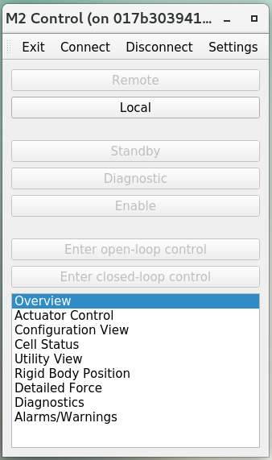

  Main panel of application

After the execution of GUI, you will see the above main panel.
You can use the top toolbar to change the settings of GUI, connect/disconnect the M2 cell controller, and exit the application.
The central region of main panel is to change the command source between the remote (or automatic, see `ts_m2 <https://ts-m2.lsst.io/>`_) and local controls, and transition the system into different state or control mode.

When the M2 system is operating in remote mode, all the commanding features of the GUI are disabled and the GUI is set to a Read-Only mode where telemetry can be viewed, but no changes to the M2 controller can be made.
This is to prevent conflicting commands between the local and remote systems.
When the M2 system is operating in the local mode, commanding from the GUI is activated and user can begin to interface with the M2 controller.

The bottom region of main panel is to open multiple tables by double-click to give more detailed system information or finer control of actuators.
If you move the mouse close to the buttons, you will see the prompted tips to explain details.

.. _lsst.ts.m2gui-user_settings:

Settings
--------

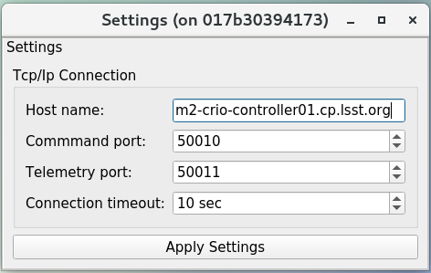

  Settings of application

You can modify the settings in application.
The default values come from the configuration file.
After the modification, you can click the button "Apply Settings" to use the new values.

.. _lsst.ts.m2gui-user_local_mode:

Local Mode
----------

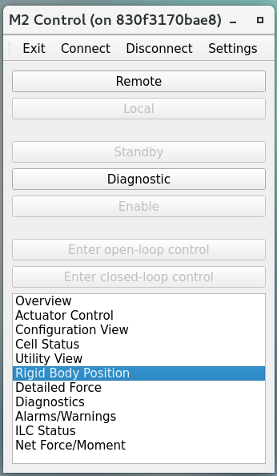

  Local mode

You can control the M2 directly from the local mode.
If the system is under the remote control originally, this action will take over the control, and the M2 cell controller listens to the command from GUI only.
You can trainsition the system into the diagonostic state to check the system status without energizing the actuators.
Or you can transition the sytem into the enabled state to command the M2 hardware with the open-loop or closed-loop control.
If the system is under the closed-loop control, the look-up table (LUT) and force balance system are applied to compensate the affections from the temperature fluctuation and gravity.

.. _lsst.ts.m2gui-user_exit:

Exit
----

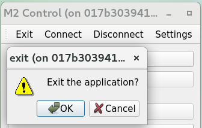

  Exit the application

You can click the "exit" button to leave the application, and a window will prompt out to confirm this action. The GUI code has been written to allow the user to quit the application at any time.
If power is being applied to the M2 cell assembly prior to hitting the exit (GUI) button, the M2 cell control system will gracefully power down before stopping the process.

Individual power control over the motor and communications power supplies can be achieved by accessing the Diagnostic state and using the binary controls in the Diagnostics view to control the power state of the motor or communications power supplies.

.. _lsst.ts.m2gui-user_overview:

Overview
--------

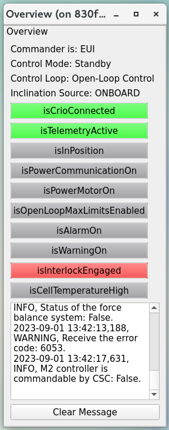

  System overview

The overview table can be used to check the system high-level status.
The logged message will be recorded in this table and you can use the button of "Clear Message" to clear it.

.. _lsst.ts.m2gui-user_actuator_control:

Actuator Control
----------------

.. figure:: ../screenshot/actuator_control.png
  :width: 550

  Actuator control

The actuator control group is a feature which allows the user to directly command individual actuators in an open loop setting.
This consists of two main blocks, the actuator control block and the actuator selector block.
The actuator control block is only active when the system is in the Local Enable state and the controller is set to Opened-Loop operation.
The actuator selector block allows the user to pick which actuator is to be sent the command.
Buttons within the actuator selector block facilitate the selection of one or multiple actuators.
The actuators are identified by their alphanumeric cell designations as illustrated by the T14900-1000 drawing.
The group select feature allows the user to select entire rings of actuators at a time without having to click each individual cell.

Once the actuator(s) has been set in the actuator selector block, the actuator control block then determines the distance the actuator is commanded.
The opened-loop commanding distance can be specified in millimeters or actuator steps.
If commanding the actuators in steps, the input must be an integer number.
With the actuator selections complete and the distance to move entered, the user can select the Start button to send the command out to the actuator(s).
During the execution of the opened-loop command the Stop, Pause, and Resume commands in the Actuator Control block can be used to intervene if necessary.

To be consistent with other procedures, a “Retract” move requires a negative step or mm command while an “Extend” move requires a positive step or mm command in the Actuator Control block.
The step speed limit when in closed-loop control is dictated in configuration files and can be changed but is traditionally limited to 75 steps per sample for both axial and tangent actuators.

You can also use the script to control the actuators continuously (see `ts_mtm2_matlab_tools <https://https://github.com/lsst-ts/ts_mtm2_matlab_tools/>`_ for the details).
This provides the user with the ability to run pre-processed scripts as open or closed loop commands to the M2 controller.
The intent of script control is to provide the user with the ability to command time-based waveforms of either step commands or delta force commands.
In operation, it has been used for frequency response testing and influence matrix evaluation.

The script control group will only permit an open loop script if the system is in open loop mode, and it will only permit a closed loop script if the system is in closed loop mode.
When a closed loop script is commanded, it is sent as a delta force command to the current LUT-based force command.
It is analogous to the ApplyForces command in remote operation mode, but the script can send a block of force commands which execute at each time step.
At each time step, the command (whether open or closed loop) must be determined for all 78 actuators.

The script is executed one sample at a time until the end of the script is reached.
Upon finishing, the system will remain in the same mode under which the script was executed.
To use the script control feature, ensure the system is in the Enable Local Mode and select the Open or Closed Loop setting based on the script to be run.
Next select Load Script in the script control group.
This will bring up an explorer window to allow the user to select the desired script to be run.
Once the script has been successfully loaded, the Run button may be selected.
The progress bar in the script group will update to display the percentage of the script that has been executed.
During the script execution, the Stop, Pause, or Resume buttons can be used to intervene in the script operation.

The small panes contain statistical information about the forces on the axial and tangent actuator sets.

.. _lsst.ts.m2gui-user_configuration_view:

Configuration View
------------------

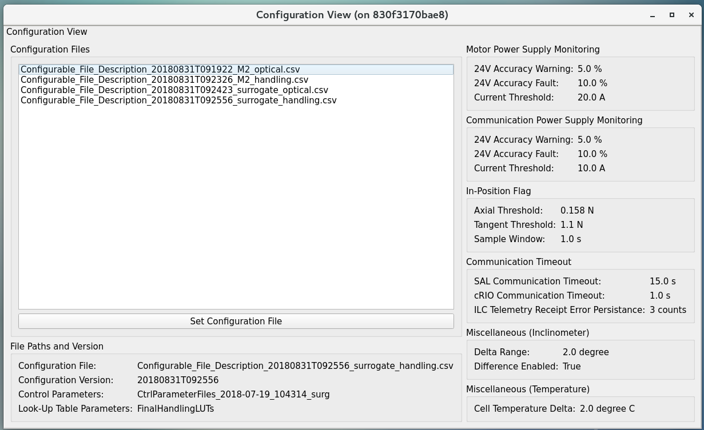

  Configuration

The configuration view is used to observe the current values of the configurable parameters in the M2 cell controller.
For creating and editing configuration files, reference the Configuration File Description Document, T14900-1005.

.. _lsst.ts.m2gui-user_cell_status:

Cell Status
-----------

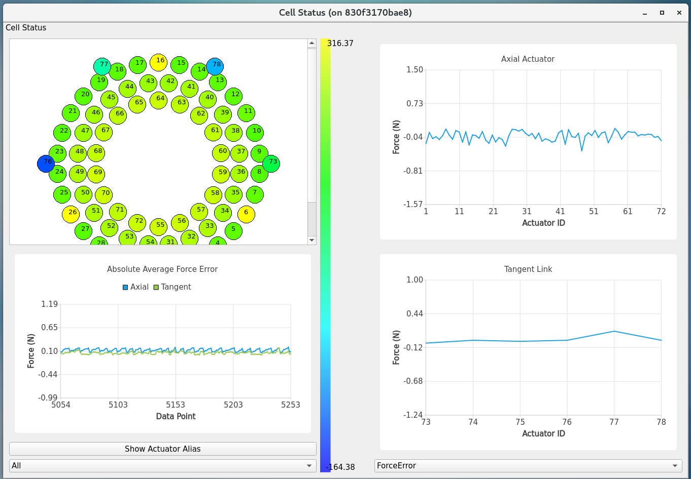

  Cell status

The cell status view is intended to provide a quick summary of the M2 cell control system at a glance.
It does not contain any state dependent features; therefore it will always be active.
The cell status view contains plots of critical telemetry against the current time to provide time history of data.
A force contour plot is also provided in the cell status table.
The force contour plot is updated with force telemetry and is meant to provide additional visual feedback on the status of the M2 system.

.. _lsst.ts.m2gui-user_utility_view:

Utility View
------------

.. figure:: ../screenshot/utility_view.png
  :width: 550

  Utility status

The utility view allows the user to observe auxiliary sensor feedback from the cell and interface with some low-level system commands.
It is divided up into the power block, breakers block, temperature block, and displacement sensors block.
The power block displays the current status of the communication and motor power supplies.
The voltage and current are displayed for both.
The breakers block shows the current status of the individual breakers on the power supply lines to the cell.
Buttons are available to reset the breakers for the motor or communications power lines independently.

The temperatures block is separated into the cell internal temperatures and the mirror temperatures.
The cell internal temperatures monitor the intake and exhaust of the cooling system in the cell.
The mirror temperatures indicate the temperature sensed at the discrete locations on the back of the mirror.
Reference the T14901-1000 drawing for mapping of indices to physical locations on the back of the M2 mirror.
The displacement sensors block displays the current telemetry reported by all 12 displacement sensors.
An orthogonal pair of displacement sensors exist at each tangent pad location.
The raw, uncalibrated inclination angle from the local M2 inclinometer is also displayed in the elevation angle block.

.. _lsst.ts.m2gui-user_rigid_body_position:

Rigid Body Position
-------------------

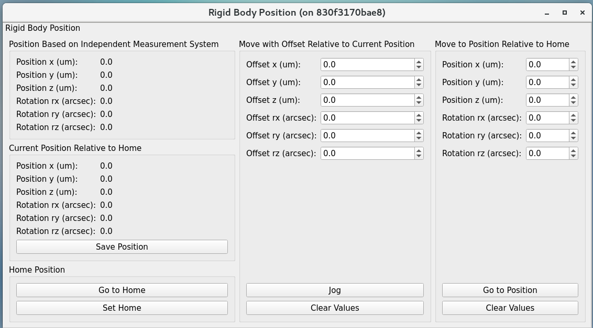

  Rigid body

The rigid body position view provides the user the ability to adjust and view the current rigid body position of the M2 mirror.
Following the protocol of the M2 interface communication document (ICD), the rigid body position table will only accept commands when the system is in Local Enable and is in closed loop control.
When the system is not in the states as specified, the rigid body position table can still be used to view the current rigid body position of the M2 mirror.
All coordinates reference the optical coordinate system provided in LTS-136.

The "Move with Offset Relative to Current Position" block sends a relative six degree of freedom command to the mirror to jog it with respect to its current position.
Enter the desired six degree of freedom relative command in the input boxes and select the Jog button to send the commands to the controller.
Once complete, the change will be reflected in the "Current Position Relative to Home" block.

The "Move to Position Relative to Home" blocks allows the user to enter an absolute six degree of freedom position to command to the mirror.
The absolute position is relative to a home position.

The rigid body position view also allows the user to use the current position of the mirror to set the home position.
By selecting the Set Home button, the current position is written into the M2 cell controller as the home position and now all absolute positions are relative to the new home position.
A Home position must be set prior to using any absolute position moves.
A reasonable (near midstroke of all actuators) Home position was set prior to shipment but can be rewritten any time.

Selecting the Go To Home button will drive the mirror from its current position to the saved home position.
Using the "Move to Position Relative to Home" block and entering all zeros for each degree of freedom is equivalent to selecting the Go To Home button.
Current position can be saved by using the Save Position button.

.. _lsst.ts.m2gui-user_detailed_force:

Detailed Force
-------------------

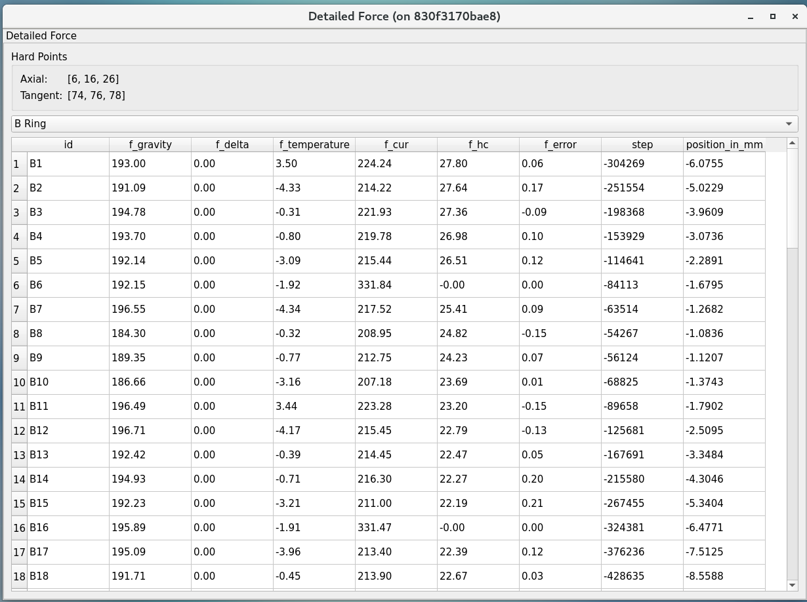

  Detailed force

The detailed force view is a read only display of the current forces and displacements of each actuator on the M2.
The selected hardpoints are displayed in the Hard Points block to the top of the table.
The upper selector allows the user to quickly jump to individual sets of actuator rings within the cell.
The unit of displayed force is Newton.
The force values displayed in the Force table detail the components of the force command as well as the raw measured force from the load cell.

.. _lsst.ts.m2gui-user_diagnostics:

Diagnostics
-----------

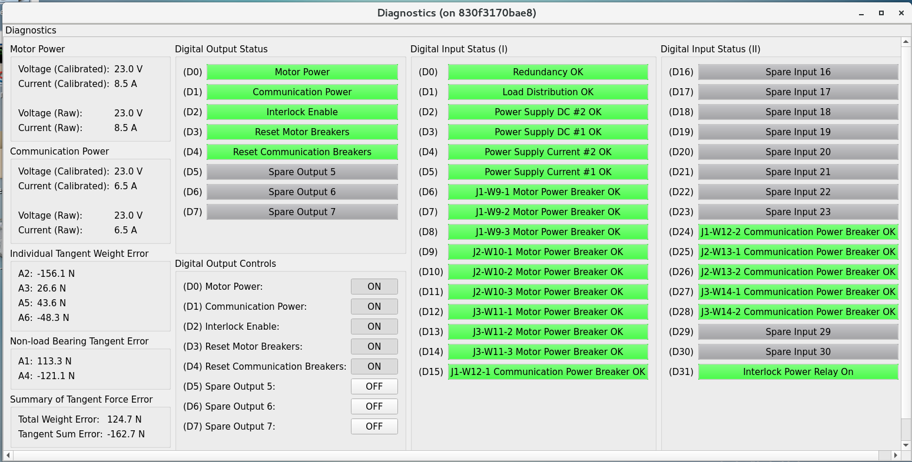

  Diagnostics

The diagnostics view provides further lower level interfaces within the cell.
This view is available for observation any time during the operation of the M2 but the input buttons are only valid when the controller is in Local Diagnostic mode.
When in Local Diagnostic mode, the user can command individual binary signals to the cell regarding breaker resets, individual power supply controls, or interlocks.
The diagnostic view provides telemetry feedback on the individual power supplies in both the calibrated and raw forms.
In addition, the diagnostics view contains real time telemetry of the tangent load cell fault monitoring as well as the raw and calibrated power telemetry for the motor and communications power buses.

The diagnostics view also contains a button to reboot the cell controller.
This button is only active when both power supplies are off.

.. _lsst.ts.m2gui-user_alarm_warn:

Alarms/Warnings
---------------

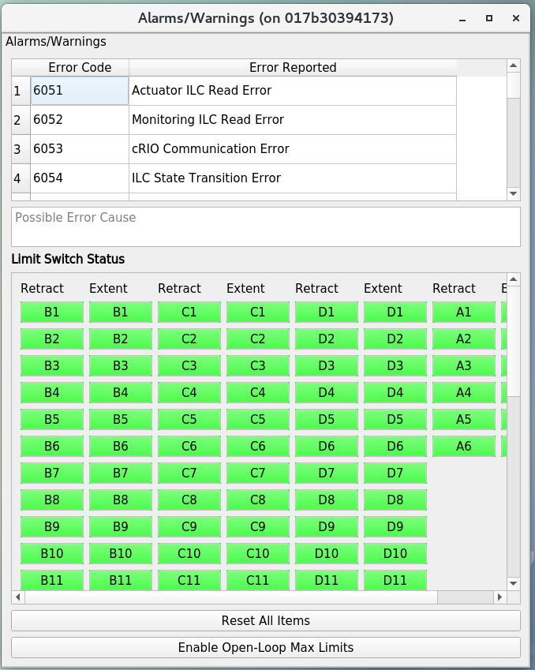

  Alarms and warnings

The alarms/warnings view provides detailed feedback on the current faults and warnings state of the controller.
This view lists all possible faults and warnings that are evaluated via the M2 cell control software.
Selecting one of the faults allows the user to see additional details and characteristics of the fault or warning condition.
During operation, if a fault is present, the fault row will highlight in red, or yellow for a warning.
The limit switch statuses are displayed via LEDs for each actuator.
The retract and extend limit switches are displayed in individual columns.
The alarms/warnings view contains the user input to manually reset the faults/warnings.

The Reset All Items button resets all faults and if the fault condition has been removed, the fault will clear and the red highlighted row(s) will be removed.
Warning conditions are not latched, therefore, when the violating condition is relieved, the warning indication automatically clears.

In some cases, you may want to use the button of "Enable Open-Loop Max Limits" to allow a increased force range to move some specific actuators back to safer positions.
This can only be done under the open-loop control, and it will be reset back a smaller force range after the system transitions to the closed-loop control.
